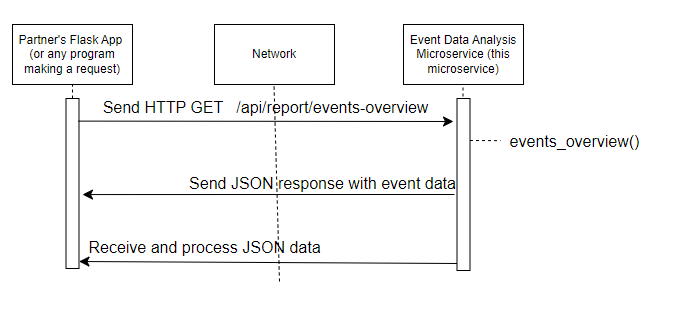

# CS361-event-data-analysis-microservice
Microservice for CS361 - Software Engineering I

# Event Data Analysis Microservice
## Description
The microservice offers an API endpoint for analyzing event registration data. It is designed to assist administrators and organizers in managing educational events by providing insights into registration patterns across different events, categories, and dates.

## Features
An endpoint (/api/report/events-overview) for fetching event registration data.
Compatibility with front-end visualization libraries like Chart.js.
Mock data for visualization while endpoint for gathering event data from partner's database is being established.

## Getting Started

To use this microservice, you will need to have Python and Flask installed on your local machine.

## Running the Microservice Locally

1. Clone the repository to your local machine:
git clone https://github.com/jpribbeno/CS361-event-data-analysis-microservice.git

2. Navigate to the cloned repository:

cd CS361-event-data-analysis-microservice

3. Install the required dependencies:
pip install -r requirements.txt

4. Start the microservice:
python microservice.py

## Requesting Data
To request data from the microservice, you will need to make an HTTP GET request to the following endpoint:
GET http://localhost:5001/api/report/events-overview

### Example Request in Python

Here is an example of how you can make a request to the microservice using Python:

```python
import requests

response = requests.get('http://localhost:5001/api/report/events-overview')
if response.status_code == 200:
    data = response.json()
    print(data)
else:
    print('Failed to retrieve data')
```

## Receiving Data 
The microservice will send back a JSON response containing an overview of event registrations. The JSON response will look something like this:

[
  {
    "category": "Academic",
    "date": "2023-03-15",
    "event_id": 1,
    "registrations": 150
  },
  {
    "category": "Professional Development",
    "date": "2023-04-20",
    "event_id": 2,
    "registrations": 100
  }
]

## UML Sequence Diagram
Refer to the UML sequence diagram included in the repository to understand the sequence of interactions between the client (in this case, my partner's Flask app), the microservice, and the data processing mechanism. The diagram is located at: UML Microservice.png.

